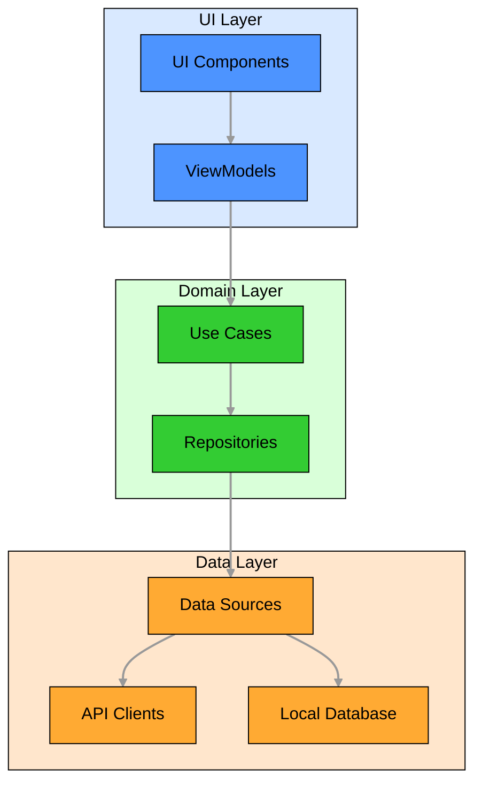
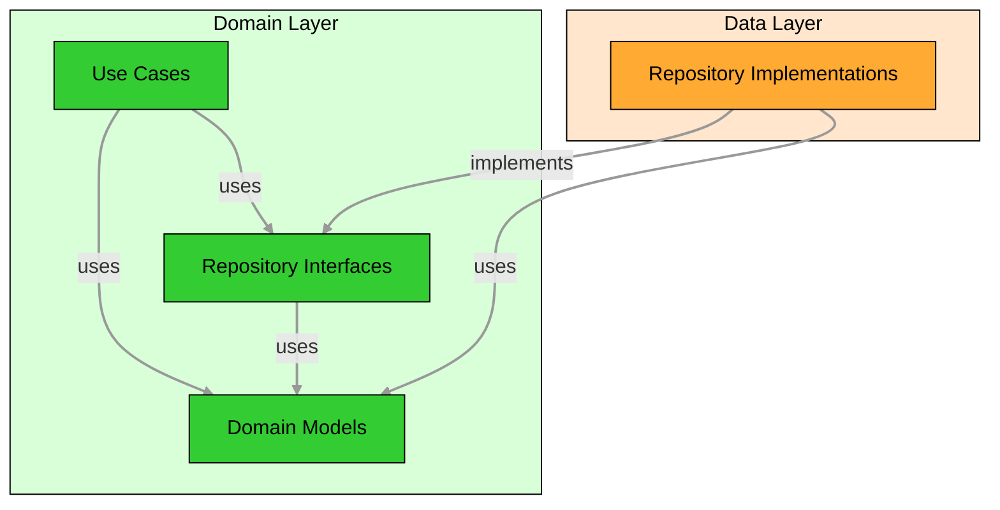
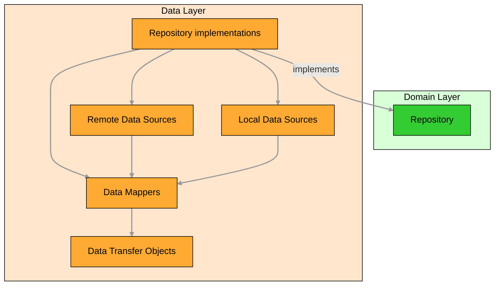

# 🏗️ Architecture

The application follows a modular architecture with clear separation between different layers and
components. The architecture is designed to support CryptoBook Android while maximizing code reuse,
maintainability, and testability.

## 🔑 Key Architectural Principles

- **🧩 Modularity**: The application is divided into distinct modules with clear responsibilities
- **🔀 Separation of Concerns**: Each module focuses on a specific aspect of the application
- **⬇️ Dependency Inversion**: Higher-level modules do not depend on lower-level modules directly
- **🎯 Single Responsibility**: Each component has a single responsibility
- **🧹 Clean Architecture**: Separation of UI, domain, and data layers
- **🧪 Testability**: The architecture facilitates comprehensive testing at all levels

## 📝 Architecture Decision Records

The Architecture Decision Records document the architectural decisions made during the development
of the project,
providing context and rationale for key technical choices. (planned under `docs/architecture/adr/`)

## 📦 Module Structure

The application is organized into several module types:

- **📱 App Module**: `app` - Application entry point
- **✨ Feature Modules**: `home:*`, `coin-detail:*`, `settings:*`, `main:*`, and `splash:*` -
  Independent feature modules
- **🧰 Core Modules**: `core:*` - Foundational components and utilities used across multiple features

For more details on the module organization and structure, see the `module-organization.md` and
`module-structure.md` documents. (planned)

## 🧩 Architectural Patterns

The architecture follows several key patterns to ensure maintainability, testability, and separation
of concerns:

### Clean Architecture

CryptoBook Android uses **Clean Architecture** with three main layers (UI, domain, and data) to
break down complex
feature implementation into manageable components. Each layer has a specific responsibility:



#### 🖼️ UI Layer (Presentation)

The UI layer is responsible for displaying data to the user and handling user interactions.

**Key Components:**

- **🎨 [Compose UI](ui-architecture.md#-screens)**: Screen components built with Jetpack Compose
- **🧠 [ViewModels](ui-architecture.md#-viewmodel)**: Manage UI state and handle UI events
- **📊 [UI State](ui-architecture.md#-state)**: Immutable data classes representing the UI state
- **🎮 [Events](ui-architecture.md#-events)**: User interactions or system events that trigger state
  changes
- **🔔 [Effects](ui-architecture.md#effects)**: One-time side effects like navigation or showing
  messages

**Pattern: Model-View-Intent (MVI)**

- **📋 Model**: UI state representing the current state of the screen
- **👁️ View**: Compose UI that renders the state
- **🎮 Event**: User interactions that trigger state changes (equivalent to "Intent" in standard MVI)
- **🔔 Effect**: One-time side effects like navigation or notifications

#### 🧠 Domain Layer (Business Logic)

The domain layer contains the business logic and rules of the application. It is independent of the
UI and data layers,
allowing for easy testing and reuse.

**Key Components:**

- **⚙️ Use Cases**: Encapsulate business logic operations
- **📋 Domain Models**: Represent business entities
- **📝 Repository Interfaces**: Define data access contracts



#### 💾 Data Layer

The data layer is responsible for data retrieval, storage, and synchronization.

**Key Components:**

- **📦 Repository implementations**: Implementations of repository interfaces from the domain layer
- **🔌 Data Sources**: Provide data from specific sources (API, WebSocket, database, preferences)
- **📄 Data Transfer Objects**: Represent data at the data layer

**Pattern: Data Source Pattern**

- 🔍 Abstracts data sources behind a clean API
- Maps data between domain models and data transfer objects



### 🔄 Immutability

Immutability means that once an object is created, it cannot be changed. Instead of modifying
existing objects, new objects are created with the desired changes. In the context of UI state, this
means that each state object represents a complete snapshot of the UI at a specific point in time.

**Why is Immutability Important?**

Immutability provides several benefits:

- **Predictability**: With immutable state, the UI can only change when a new state object is
  provided, making the flow of data more predictable and easier to reason about.
- **Debugging**: Each state change creates a new state object, making it easier to track changes and
  debug issues by comparing state objects.
- **Concurrency**: Immutable objects are thread-safe by nature, eliminating many concurrency issues.
- **Performance**: While creating new objects might seem inefficient, modern frameworks optimize
  this process, and the benefits of immutability often outweigh the costs.
- **Time-travel debugging**: Immutability enables storing previous states, allowing developers to "
  time travel" back to previous application states during debugging.

## 🎨 UI Architecture

The UI is built using Jetpack Compose with a component-based architecture following our modified
Model-View-Intent (MVI) pattern. This architecture provides a unidirectional data flow, clear
separation of concerns, and improved testability.

For detailed information about the UI architecture, see the [UI Architecture](ui-architecture.md).

## 💉 Dependency Injection

The application
uses [Hilt](https://developer.android.com/training/dependency-injection/hilt-android) for dependency
injection, with modules organized by feature:

- **📱 App Modules**: Configure application-wide dependencies
- **✨ Feature Modules**: Configure feature-specific dependencies
- **🧰 Core Modules**: Configure core dependencies

### ⚠️ Error Handling

The application implements a comprehensive error handling strategy across all layers. We favor using
the Outcome pattern
over exceptions for expected error conditions, while exceptions are reserved for truly exceptional
situations that
indicate programming errors or unrecoverable system failures.

- 🧠 **Domain Errors**: Encapsulate business logic errors as sealed classes, ensuring clear
  representation of specific
  error cases.
- 💾 **Data Errors**: Transform network or database exceptions into domain-specific errors using
  result patterns in repository implementations.
- 🖼️ **UI Error Handling**: Provide user-friendly error feedback by:
    - Mapping domain errors to UI state in ViewModels.
    - Displaying actionable error states in Compose UI components.
    - Offering retry options for network connectivity issues.

> [!NOTE]  
> Exceptions should be used sparingly. Favor the Outcome pattern and sealed classes for predictable
> error conditions to
> enhance maintainability and clarity.

#### 🛠️ How to Implement Error Handling

When implementing error handling in your code:

1. **Define domain-specific errors** as sealed classes in your feature's domain layer:

   ```kotlin
   sealed class AccountError {
       data class AuthenticationFailed(val reason: String) : AccountError()
       data class NetworkError(val exception: Exception) : AccountError()
       data class ValidationError(val field: String, val message: String) : AccountError()
   }
   ```
2. **Use result patterns (Outcome)** instead of exceptions for error handling:

   ```kotlin
   // Use the Outcome class for representing success or failure
   sealed class Outcome<out T, out E> {
       data class Success<T>(val value: T) : Outcome<T, Nothing>()
       data class Failure<E>(val error: E) : Outcome<Nothing, E>()
   }
   ```
3. **Transform external errors** into domain errors in your repositories using result patterns:

   ```kotlin
   // Return Outcome instead of throwing exceptions
   fun authenticate(credentials: Credentials): Outcome<AuthResult, AccountError> {
       return try {
           val result = apiClient.authenticate(credentials)
           Outcome.Success(result)
       } catch (e: HttpException) {
           val error = when (e.code()) {
               401 -> AccountError.AuthenticationFailed("Invalid credentials")
               else -> AccountError.NetworkError(e)
           }
           logger.error(e) { "Authentication failed: ${error::class.simpleName}" }
           Outcome.Failure(error)
       } catch (e: Exception) {
           logger.error(e) { "Authentication failed with unexpected error" }
           Outcome.Failure(AccountError.NetworkError(e))
       }
   }
   ```
4. **Handle errors in Use Cases** by propagating the Outcome:

   ```kotlin
   class LoginUseCase(
       private val accountRepository: AccountRepository,
       private val credentialValidator: CredentialValidator,
   ) {
       fun execute(credentials: Credentials): Outcome<AuthResult, AccountError> {
           // Validate input first
           val validationResult = credentialValidator.validate(credentials)
           if (validationResult is ValidationResult.Failure) {
               return Outcome.Failure(
                   AccountError.ValidationError(
                       field = validationResult.field,
                       message = validationResult.message
                   )
               )
           }

           // Proceed with authentication
           return accountRepository.authenticate(credentials)
       }
   }
   ```
5. **Handle outcomes in ViewModels** and transform them into UI state:

   ```kotlin
   viewModelScope.launch {
       val outcome = loginUseCase.execute(credentials)

       when (outcome) {
           is Outcome.Success -> {
               _uiState.update { it.copy(isLoggedIn = true) }
           }
           is Outcome.Failure -> {
               val errorMessage = when (val error = outcome.error) {
                   is AccountError.AuthenticationFailed -> 
                       stringProvider.getString(R.string.error_authentication_failed, error.reason)
                   is AccountError.NetworkError -> 
                       stringProvider.getString(R.string.error_network, error.exception.message)
                   is AccountError.ValidationError -> 
                       stringProvider.getString(R.string.error_validation, error.field, error.message)
               }
               _uiState.update { it.copy(error = errorMessage) }
           }
       }
   }
   ```
6. **Always log errors** for debugging purposes:

   ```kotlin
   // Logging is integrated into the Outcome pattern
   fun fetchMessages(): Outcome<List<Message>, MessageError> {
       return try {
           val messages = messageService.fetchMessages()
           logger.info { "Successfully fetched ${messages.size} messages" }
           Outcome.Success(messages)
       } catch (e: Exception) {
           logger.error(e) { "Failed to fetch messages" }
           Outcome.Failure(MessageError.FetchFailed(e))
       }
   }
   ```
7. **Compose multiple operations** that return Outcomes:

   ```kotlin
   fun synchronizeAccount(): Outcome<SyncResult, SyncError> {
       // First operation
       val messagesOutcome = fetchMessages()
       if (messagesOutcome is Outcome.Failure) {
           return Outcome.Failure(SyncError.MessageSyncFailed(messagesOutcome.error))
       }

       // Second operation using the result of the first
       val messages = messagesOutcome.getOrNull()!!
       val folderOutcome = updateFolders(messages)
       if (folderOutcome is Outcome.Failure) {
           return Outcome.Failure(SyncError.FolderUpdateFailed(folderOutcome.error))
       }

       // Return success with combined results
       return Outcome.Success(
           SyncResult(
               messageCount = messages.size,
               folderCount = folderOutcome.getOrNull()!!.size
           )
       )
   }
   ```

## 🔄 User Flows

The `user-flows.md` document provides visual representations of typical user flows through the
application, helping to understand how different components interact. (planned)
